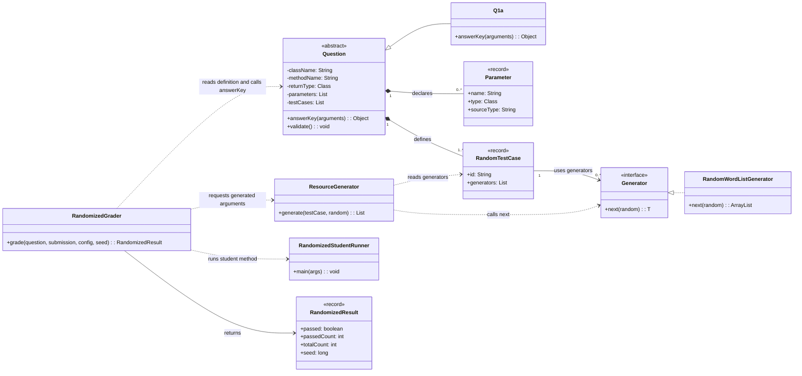

```mermaid
classDiagram
    direction LR

    class Question {
        <<abstract>>
        -className: String
        -methodName: String
        -returnType: Class
        -parameters: List
        -testCases: List
        +answerKey(arguments): Object
        +validate(): void
    }

    class Q1a {
        +answerKey(arguments): Object
    }

    class Parameter {
        <<record>>
        +name: String
        +type: Class
        +sourceType: String
    }

    class RandomTestCase {
        <<record>>
        +id: String
        +generators: List
    }

    class Generator {
        <<interface>>
        +next(random): T
    }

    class RandomWordListGenerator {
        +next(random): ArrayList
    }

    class ResourceGenerator {
        +generate(testCase, random): List
    }

    class RandomizedGrader {
        +grade(question, submission, config, seed): RandomizedResult
    }

    class RandomizedStudentRunner {
        +main(args): void
    }

    class RandomizedResult {
        <<record>>
        +passed: boolean
        +passedCount: int
        +totalCount: int
        +seed: long
    }

    Question <|-- Q1a
    Generator <|.. RandomWordListGenerator

    Question "1" *-- "0..*" Parameter : declares
    Question "1" *-- "1..*" RandomTestCase : defines
    RandomTestCase "1" --> "0..*" Generator : uses generators

    RandomizedGrader ..> Question : reads definition and calls answerKey
    RandomizedGrader ..> ResourceGenerator : requests generated arguments
    ResourceGenerator ..> RandomTestCase : reads generators
    ResourceGenerator ..> Generator : calls next
    RandomizedGrader ..> RandomizedStudentRunner : runs student method
    RandomizedGrader --> RandomizedResult : returns
```